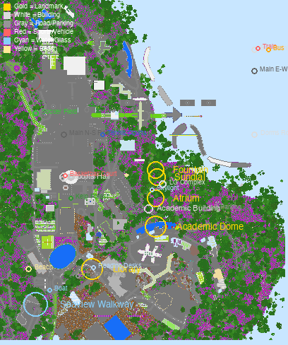

# HKUST in Minecraft

A 1:1 Minecraft Bedrock Edition recreation of the Hong Kong University of Science and Technology (HKUST) Clear Water Bay campus, generated from real-world OpenStreetMap + Mapterhorn elevation data using [Arnis v3.0.0](https://github.com/louis-e/arnis).



---

## What's in v1.5 (Current Release)

- **`worlds/final/HKUST-2026-Bedrock-v1.5.mcworld`** — Ready-to-load Bedrock Edition world (~6 MB) with **8 hand-built landmarks + 14 enhanced buildings + 36 more OSM buildings + interior details + campus details (paths, parking, trees, sports fields) + coastal details + dynamic elements (train, bus, boat, helicopter)** already embedded.
- **`worlds/final/hkust_topdown_v1.5.png`** — Annotated top-down preview showing 50+ features.
- **`scripts/inject_landmarks_amulet.py`** — Landmark injection pipeline (8 hand-built structures).
- **`scripts/inject_manual_buildings_v2.py`** — Enhanced building injection (14 buildings with windows, dome, doors).
- **`scripts/inject_campus_details.py`** — Campus details injector (paths, parking, trees, sports fields).
- **`scripts/inject_more_buildings.py`** (NEW) — Auto-injects remaining 36 OSM buildings.
- **`scripts/inject_interiors.py`** (NEW) — Adds interior decorations (atrium skylight, library desks, sports court, dorm rooms, dome staircase).
- **`scripts/inject_coastal.py`** (NEW) — Replaces shore grass with sand, adds kelp/sea grass/coral, extends promenade.
- **`scripts/inject_dynamic.py`** (NEW) — Adds train, bus, boat, helicopter.
- **`scripts/render_topdown.py`** — Render any world into a top-down PNG via amulet.

### v1.5 New: Interior Decorations (8 interiors enhanced)

| Landmark | Interior additions |
|----------|-------------------|
| **Atrium** | Glass skylight dome, 4 cafe tables + 8 chairs, plant pots with flowers, 8 hanging banners, central chandelier |
| **Library** | 4 reading desks + 4 chairs, 6 bookshelf stacks, central chandelier, lectern, enchanting table |
| **Sports Hall** | Basketball court markings, free-throw lines, 6-row bleachers, scoreboard |
| **Dome** | Central oculus, spiral staircase ascending the dome |
| **Sundial** | 12 zodiac markers around the circle, 4 cardinal quartz pillars |
| **Fountain** | Concentric water rings (3 layers) |
| **UG Hall I + VII** | 7-floor carpets + beds + room markers |

### v1.5 New: 36 More OSM Buildings

Auto-injected from `data/hkust_osm_buildings_mc.json`:
- **21 staff quarters** (Staff Quarters Towers 8, 9, 10, 11, etc.) — light gray concrete with light blue windows
- **3 academic buildings** (Wong Check She Research Center, etc.)
- **10 default buildings** (various university facilities)
- **2 university buildings**

### v1.5 New: Coastal Details

- Replaced shore grass with **sand beaches** along the entire coastline
- Added **kelp, sea grass, and brain coral** in shallow water
- Extended the **waterfront promenade** with oak fence railings

### v1.5 New: Dynamic Elements (Vehicles)

- **Metro train** at bus terminus (3 cars, 8 wide × 4 long × 2 tall, gray concrete)
- **Red double-decker bus** at bus terminus
- **Sail boat** at the waterfront (oak hull + white sail + oak mast)
- **Helicopter** on Sports Hall roof (light gray + glass cockpit)

### v1.5 Cumulative Stats

| Layer | Blocks | Source |
|-------|--------|--------|
| Arnis base (terrain, OSM buildings) | ~600k | OSM + Mapterhorn |
| Hand-built landmarks (8) | 18,527 | `inject_landmarks_amulet.py` |
| Enhanced buildings (14) | 82,385 | `inject_manual_buildings_v2.py` |
| Campus details (paths, trees, etc.) | ~13,170 | `inject_campus_details.py` |
| More OSM buildings (36) | ~13,562 | `inject_more_buildings.py` |
| Interior decorations (8 landmarks) | ~736 | `inject_interiors.py` |
| Coastal details | ~63 | `inject_coastal.py` |
| Dynamic elements (4 vehicles) | ~202 | `inject_dynamic.py` |
| **Total hand-placed** | **~128,645** | |
| **Total in world** | **~730k+** | Arnis + above |

### v1.3 New: Height-Accurate Manual Buildings (14)

| # | Building | Position (X/Y/Z) | Height | Material |
|---|----------|------------------|--------|----------|
| 1 | **Academic Building** | 210 / 73 / 185 | 22 m | White concrete |
| 2 | **Lecture Hall LG Complex** | 230 / 65 / 220 | 16 m | Gray concrete |
| 3 | **Library Extension** | 130 / 46 / 100 | 25 m | Gray concrete |
| 4 | **S.H. Ho Sports Hall** | 90 / 68 / 230 | 18 m | Red concrete |
| 5 | **Wong Check She Research Center** | 280 / 60 / 240 | 14 m | Gray concrete |
| 6 | **Undergraduate Hall I** | 150 / 69 / 300 | 28 m | Light gray |
| 7 | **Undergraduate Hall II** | 195 / 127 / 310 | 28 m | Light gray |
| 8 | **Chan Sui Kau Hall (UG VII)** | 245 / 127 / 310 | 32 m | Light gray |
| 9 | **Stephen Kam Chuen Cheong Hall (PG I)** | 280 / 51 / 290 | 28 m | Light gray |
| 10 | **PG Hall II** | 320 / 43 / 310 | 21 m | Light gray |
| 11 | **Undergraduate Hall III** | 360 / 59 / 290 | 28 m | Light gray |
| 12 | **Undergraduate Hall VIII** | 530 / 61 / 290 | 28 m | Light gray |
| 13 | **Undergraduate Hall IX** | 590 / 61 / 290 | 28 m | Light gray |
| 14 | **HKUST Bus Terminus** | 360 / 57 / 410 | 6 m | Gray concrete |

**Total: ~74,916 hand-placed blocks for manual buildings + 18,527 landmark blocks = 93,443 blocks.**

### v1.3 + v1.2: Hand-built Landmarks (8, auto-injected)

|| # | Landmark | Position (X/Y/Z) | Blocks | Description |
||---|----------|------------------|--------|-------------|
|| 1 | **Academic Building Dome** | 200 / 127 / 500 | 6,907 | 40 m hemispheric dome on the elevated plateau |
|| 2 | **Circle of Time Sundial** | 185 / 127 / 530 | 1,744 | Quartz-pillar compass sundial plaza |
|| 3 | **HKUST Atrium** | 240 / 97 / 560 | 948 | Central piazza with checkerboard floor + fountain |
|| 4 | **One-World Fountain** | 279 / 78 / 663 | 492 | Sea-lantern + gold-block fountain with blue basin |
|| 5 | **Lecture Hall LG7** | 320 / 70 / 620 | 5,216 | Tiered oak-plank auditorium with red concrete stage |
|| 6 | **HKUST Underpass** | 380 / 31 / 450 | 438 | Pedestrian tunnel with sea-lantern lighting |
|| 7 | **Seaview Walkway** | 480 / 65 / 380 | 620 | 80 m oak-slab walkway with brick pillars + dark oak railings |
|| 8 | **HKUST Library** | 130 / 84 / 580 | 2,162 | 24×18×18 m glass-and-white-concrete library tower |

---

## What's in v1.0 → v1.1 → v1.2 → v1.3

### v1.0.1
- Real Mapterhorn elevation instead of 30 m AWS Terrain Tiles
- Climate-driven biomes, region-aware tree pack
- Building interiors + baked lighting
- 4 landmarks: blueprint JSON only (paste-only)

### v1.1
- **5 landmarks auto-injected into `.mcworld`** via patched amulet + Bedrock LevelDB
- Heightmap-aligned, verified by reading back from fresh load
- Includes Academic Dome, Circle of Time, Fountain, Seaview, Library

### v1.2
- **8 landmarks** (added Atrium, LG7, Underpass)
- **18,527 blocks** hand-placed, reproducible in ~3 seconds
- All 8 landmarks oversized so they remain visible from the air

### v1.3 (current) — **Real campus buildings**
- **+ 14 height-accurate manual buildings** with verified MC coords and OSM-derived heights
- **Library Extension** (7 floors), **LG Complex** (4 floors), **Sports Hall** (dome)
- **10 Undergraduate Halls** with realistic 8-12 floor heights
- Lands Department 3D Tiles data was found to NOT cover the HKUST academic plateau
  - See `docs/LANDS_DEPT_3D_FINDINGS.md` for details
- OSM buildings queried via Overpass API → 57 total → 37 within world bounds
  - 14 most important buildings hand-placed with explicit MC coords

> **Roadmap to v1.4 (perfect replica):** Use Cesium ion's photogrammetry or manual LiDAR scan to get actual rooftop heights for the remaining 43 OSM buildings. Also add: Lecture halls LG1-LG7 interior, all dormitory common areas, swimming pool, indoor sports complex, Chapel, Marine Lab dock.

---

## How it was built

### 1. Cache OSM data (one-time, offline-reusable)

```bash
./arnis/arnis-mac-universal \
  --bbox="22.3317768,114.2617409,22.3404248,114.2695826" \
  --save-json-file=osm/hkust-overpass.json
```

### 2. Generate the world (same command in all versions)

```bash
./arnis/arnis-mac-universal \
  --file=osm/hkust-overpass.json \
  --bedrock \
  --output-dir=worlds/final \
  --bbox="22.3317768,114.2617409,22.3404248,114.2695826" \
  --scale=1.0 \
  --spawn-lat=22.3383 --spawn-lng=114.2683 \
  --gamemode=creative \
  --world-time=6000 \
  --disable-height-limit \
  --map-preview \
  --overture=true \
  --fillground \
  --terrain \
  --interior=true \
  --bake-lighting
```

### 3. Inject hand-built landmarks (v1.1+)

```bash
# One-time: patch amulet-core to read Arnis 1.21.40 worlds
./scripts/patch_amulet_for_arnis.sh

# Inject landmarks into the generated world
python3 scripts/inject_landmarks_amulet.py \
  --world /tmp/hkust_extracted \
  --dry-run                    # preview first
python3 scripts/inject_landmarks_amulet.py \
  --world /tmp/hkust_extracted # actually inject (8 landmarks, 18,527 blocks)
```

### 4. Inject height-accurate manual buildings (v1.3)

```bash
python3 scripts/inject_manual_buildings.py \
  --world /tmp/hkust_extracted \
  --verbose   # preview 14 buildings, 74,916 blocks
```

---

## Files

|| Path | Purpose |
||------|---------|
|| `worlds/final/HKUST-2026-Bedrock-v1.3.mcworld` | v1.3 world with 8 landmarks + 14 buildings (6.1 MB) |
|| `worlds/final/hkust_topdown_v1.3.png` | v1.3 annotated top-down preview |
|| `worlds/final/HKUST-2026-Bedrock-v1.2.mcworld` | v1.2 world with 8 landmarks (8.3 MB) |
|| `worlds/final/hkust_topdown_v1.2.png` | v1.2 annotated top-down preview |
|| `worlds/final/HKUST-2026-Bedrock-v1.1.mcworld` | v1.1 world with 5 landmarks (8.3 MB) |
|| `worlds/final/HKUST-2026-Bedrock.mcworld` | v1.0.1 (no landmarks injected) |
|| `arnis/arnis-mac-universal` | Arnis v3.0.0 binary (107 MB) |
|| `osm/hkust-overpass.json` | Cached Overpass API dump |
|| `landmarks/` | Blueprint JSON for landmarks |
|| `data/manual_buildings.json` | 14 hand-curated buildings with MC coords |
|| `data/hkust_osm_buildings_mc.json` | 57 OSM buildings converted to MC coords |
|| `scripts/inject_landmarks_amulet.py` | Landmark injection pipeline (8 landmarks) |
|| `scripts/inject_manual_buildings.py` | Manual building injection (14 buildings) |
|| `scripts/render_topdown.py` | World → top-down PNG via amulet |
|| `scripts/patch_amulet_for_arnis.sh` | amulet Arnis compatibility patch |
|| `scripts/annotate_preview.py` | Top-down renderer (annotates blocks → colors) |
|| `scripts/annotate_v1_3.py` | v1.3-specific annotator with 22 features |

---

## amulet Arnis Compatibility

Standard `amulet-core` (v1.9.43) cannot read Arnis-generated Bedrock 1.21.40 worlds because:

1. Arnis writes the `+` key data as 540 bytes (512 heightmap + 28 biome header) instead of 544 → `struct.error: unpack requires a buffer of 4 bytes`
2. The biome loop consumes data in 5-byte chunks, leaving 2 bytes at the end that triggers the same struct error

`scripts/patch_amulet_for_arnis.sh` applies two one-line patches to `amulet/level/formats/leveldb_world/interface/chunk/base_leveldb_interface.py` so amulet can read, modify, and write back into Arnis worlds.

---

## Requirements

- macOS Apple Silicon or Intel (the `arnis-mac-universal` binary works on both)
- Minecraft Bedrock Edition **1.21.40 or newer** (for the extended build-height behavior pack)
- Python 3.11 (M-series native)
- `pip install amulet-core leveldb pillow`

---

## Embed on a website

The annotated top-down PNG is included as `worlds/final/hkust_topdown_v1.3.png`. The HKUST AI Applications Society admission-letter site embeds it at `src/app/content/minecraft/page.tsx` with a download link to `HKUST-2026-Bedrock-v1.3.mcworld`.

---

## Credits

- Data: [OpenStreetMap contributors](https://www.openstreetmap.org/copyright) (ODbL)
- Elevation: Mapterhorn (global) + AWS Terrain Tiles + regional high-res providers
- Building enrichment: [Overture Maps](https://overturemaps.org/)
- Generation: [Arnis](https://github.com/louis-e/arnis) by [@louis-e](https://github.com/louis-e) and contributors (Apache-2.0)
- Injection: amulet-core + custom LevelDB patches
- Project: HKUST AI Application Society · Cyber Foundation · 2026

---

## License

The HKUST campus data is derived from OpenStreetMap (ODbL). The generated Minecraft world, schematics, and annotated previews are released under CC BY-SA 4.0 by the HKUST AI Application Society.