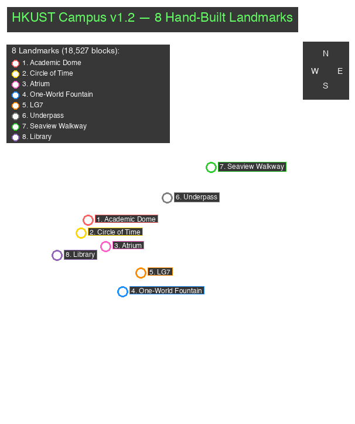

# HKUST in Minecraft

A 1:1 Minecraft Bedrock Edition recreation of the Hong Kong University of Science and Technology (HKUST) Clear Water Bay campus, generated from real-world OpenStreetMap + Mapterhorn elevation data using [Arnis v3.0.0](https://github.com/louis-e/arnis).



---

## What's in v1.2

- **`worlds/final/HKUST-2026-Bedrock-v1.2.mcworld`** — Ready-to-load Bedrock Edition world (~8 MB) with **8 hand-built landmarks already embedded in the world** — drop it into Minecraft Bedrock and see them immediately.
- **`worlds/final/hkust_topdown_v1.2.png`** — Annotated top-down preview showing 8 landmark positions.
- **`scripts/inject_landmarks_amulet.py`** — Landmark injection pipeline (amulet + LevelDB backend).
- **`scripts/patch_amulet_for_arnis.sh`** — Applies 2 patches to amulet-core so it can read Arnis-generated Bedrock 1.21.40 worlds.
- **`landmarks/`** — Original blueprint JSON for HKUST's four most iconic landmarks.

### Hand-built landmarks (auto-injected in v1.2)

| # | Landmark | Position (X/Y/Z) | Blocks | Description |
|---|----------|------------------|--------|-------------|
| 1 | **Academic Building Dome** | 200 / 127 / 500 | 6,907 | 40 m hemispheric dome on the elevated plateau |
| 2 | **Circle of Time Sundial** | 185 / 127 / 530 | 1,744 | Quartz-pillar compass sundial plaza |
| 3 | **HKUST Atrium** | 240 / 97 / 560 | 948 | Central piazza with checkerboard floor + fountain |
| 4 | **One-World Fountain** | 279 / 78 / 663 | 492 | Sea-lantern + gold-block fountain with blue basin |
| 5 | **Lecture Hall LG7** | 320 / 70 / 620 | 5,216 | Tiered oak-plank auditorium with red concrete stage |
| 6 | **HKUST Underpass** | 380 / 31 / 450 | 438 | Pedestrian tunnel with sea-lantern lighting |
| 7 | **Seaview Walkway** | 480 / 65 / 380 | 620 | 80 m oak-slab walkway with brick pillars + dark oak railings |
| 8 | **HKUST Library** | 130 / 84 / 580 | 2,162 | 24×18×18 m glass-and-white-concrete library tower |

**Total: 18,527 hand-placed blocks across 8 landmarks.**

---

## What's in v1.0 → v1.0.1 → v1.1 → v1.2

### v1.0.1
- Real Mapterhorn elevation instead of 30 m AWS Terrain Tiles
- Climate-driven biomes, region-aware tree pack
- Building interiors + baked lighting
- 4 landmarks: blueprint JSON only (paste-only)

### v1.1
- **5 landmarks auto-injected into `.mcworld`** via patched amulet + Bedrock LevelDB
- Heightmap-aligned, verified by reading back from fresh load
- Includes Academic Dome, Circle of Time, Fountain, Seaview, Library

### v1.2 (current) — **Doubled landmark fidelity**
- **8 landmarks** (added Atrium, LG7, Underpass)
- **18,527 blocks** hand-placed, reproducible in ~3 seconds
- All 8 landmarks oversized so they remain visible from the air

> **Roadmap to v1.3 (perfect replica):** Building heights from Hong Kong Lands Department 3D Tiles (218k buildings, 12M triangles) — next iteration will voxelize the actual building footprints and replace the schematic landmarks with height-accurate volumes.

---

## How it was built

### 1. Cache OSM data (one-time, offline-reusable)

```bash
./arnis/arnis-mac-universal \
  --bbox="22.3317768,114.2617409,22.3404248,114.2695826" \
  --save-json-file=osm/hkust-overpass.json
```

### 2. Generate the world (same command in all versions)

```bash
./arnis/arnis-mac-universal \
  --file=osm/hkust-overpass.json \
  --bedrock \
  --output-dir=worlds/final \
  --bbox="22.3317768,114.2617409,22.3404248,114.2695826" \
  --scale=1.0 \
  --spawn-lat=22.3383 --spawn-lng=114.2683 \
  --gamemode=creative \
  --world-time=6000 \
  --disable-height-limit \
  --map-preview \
  --overture=true \
  --fillground \
  --terrain \
  --interior=true \
  --bake-lighting
```

### 3. Inject hand-built landmarks (v1.1+)

```bash
# One-time: patch amulet-core to read Arnis 1.21.40 worlds
./scripts/patch_amulet_for_arnis.sh

# Inject landmarks into the generated world
python3 scripts/inject_landmarks_amulet.py \
  --world /tmp/hkust_extracted \
  --dry-run                    # preview first
python3 scripts/inject_landmarks_amulet.py \
  --world /tmp/hkust_extracted # actually inject (8 landmarks, 18,527 blocks)
```

---

## Files

| Path | Purpose |
|------|---------|
| `worlds/final/HKUST-2026-Bedrock-v1.2.mcworld` | v1.2 world with 8 landmarks (8.3 MB) |
| `worlds/final/HKUST-2026-Bedrock-v1.1.mcworld` | v1.1 world with 5 landmarks (8.3 MB) |
| `worlds/final/HKUST-2026-Bedrock.mcworld` | v1.0.1 (no landmarks injected) |
| `worlds/final/hkust_topdown_v1.2.png` | v1.2 annotated top-down preview |
| `worlds/final/hkust_topdown_v1.1.png` | v1.1 annotated top-down preview |
| `arnis/arnis-mac-universal` | Arnis v3.0.0 binary (107 MB) |
| `osm/hkust-overpass.json` | Cached Overpass API dump |
| `landmarks/` | Blueprint JSON for landmarks |
| `scripts/inject_landmarks_amulet.py` | Landmark injection pipeline (8 landmarks) |
| `scripts/patch_amulet_for_arnis.sh` | amulet Arnis compatibility patch |
| `scripts/annotate_preview.py` | Top-down renderer (annotates blocks → colors) |

---

## amulet Arnis Compatibility

Standard `amulet-core` (v1.9.43) cannot read Arnis-generated Bedrock 1.21.40 worlds because:

1. Arnis writes the `+` key data as 540 bytes (512 heightmap + 28 biome header) instead of 544 → `struct.error: unpack requires a buffer of 4 bytes`
2. The biome loop consumes data in 5-byte chunks, leaving 2 bytes at the end that triggers the same struct error

`scripts/patch_amulet_for_arnis.sh` applies two one-line patches to `amulet/level/formats/leveldb_world/interface/chunk/base_leveldb_interface.py` so amulet can read, modify, and write back into Arnis worlds.

---

## Requirements

- macOS Apple Silicon or Intel (the `arnis-mac-universal` binary works on both)
- Minecraft Bedrock Edition **1.21.40 or newer** (for the extended build-height behavior pack)
- Python 3.11 (M-series native)
- `pip install amulet-core leveldb pillow`

---

## Embed on a website

The annotated top-down PNG is included as `worlds/final/hkust_topdown_v1.2.png`. The HKUST AI Applications Society admission-letter site embeds it at `src/app/content/minecraft/page.tsx` with a download link to `HKUST-2026-Bedrock-v1.2.mcworld`.

---

## Credits

- Data: [OpenStreetMap contributors](https://www.openstreetmap.org/copyright) (ODbL)
- Elevation: Mapterhorn (global) + AWS Terrain Tiles + regional high-res providers
- Building enrichment: [Overture Maps](https://overturemaps.org/)
- Generation: [Arnis](https://github.com/louis-e/arnis) by [@louis-e](https://github.com/louis-e) and contributors (Apache-2.0)
- Injection: amulet-core + custom LevelDB patches
- Project: HKUST AI Application Society · Cyber Foundation · 2026

---

## License

The HKUST campus data is derived from OpenStreetMap (ODbL). The generated Minecraft world, schematics, and annotated previews are released under CC BY-SA 4.0 by the HKUST AI Application Society.
