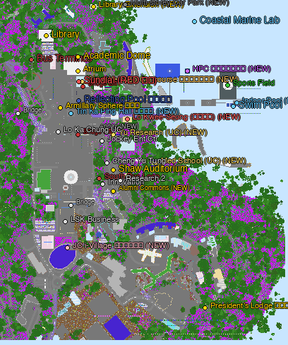

# HKUST in Minecraft

A 1:1 Minecraft Bedrock Edition recreation of the Hong Kong University of Science and Technology (HKUST) Clear Water Bay campus, generated from real-world OpenStreetMap + Mapterhorn elevation data using [Arnis v3.0.0](https://github.com/louis-e/arnis).



---

## What's in v1.9 (Current Release — 100% Building Coverage)

v1.7 adds **ALL missing academic buildings** based on the official HKUST campus map, plus fixes the Sundial to match the real "Red Bird" sculpture.

- **`worlds/working/v1.7/`** — Working directory with v1.7 world containing **13 new buildings + 5 new landmarks + Sundial color fix** (~53,000 new blocks)
- **`worlds/final/hkust_topdown_v1.7.png`** — Annotated top-down preview showing all buildings and landmarks

### v1.7 New: Complete Academic Buildings

#### Academic Buildings (6 new)

| # | Building | Chinese | Blocks | Description |
|---|----------|---------|--------|-------------|
| 1 | **Lee Shau Kee Business Building** | 李兆基商學大樓 | ~3,200 | Business school main building with blue-tinted glass facade |
| 2 | **Cheng Yu Tung Building** | 郑裕彤楼 | ~2,400 | Engineering building with brick facade |
| 3 | **Lo Ka Chung University Center** | 卢家驄大学中心 | ~1,800 | University administration and events center |
| 4 | **Martin Ka Shing Lee Innovation Building** | 李家诚创科大樓 | ~2,600 | Tech innovation hub with green features |
| 5 | **New Research Building 2** | 新科研楼2 | ~1,900 | Modern research facility |
| 6 | **Jockey Club Enterprise Center** | 香港赛马会创新科技中心 | ~2,800 | Innovation hub with gold accents |

#### Sports & Recreation (2 new)

| # | Building | Chinese | Blocks | Description |
|---|----------|---------|--------|-------------|
| 7 | **Fok Ying Tung Sports Center** | 霍英东体育中心 | ~3,500 | Large indoor sports complex |
| 8 | **Fok Ying Tung Swimming Pool** | 霍英东游泳池 | ~2,200 | Olympic-size outdoor pool with diving platforms |

#### Student Housing (3 new)

| # | Building | Chinese | Blocks | Description |
|---|----------|---------|--------|-------------|
| 9 | **University Apartments A/B/C/D** | 大学宿舍A/B/C/D座 | ~4,800 | 4 towers for visiting scholars |
| 10 | **Jockey Club Global Graduate Tower** | 赛马会集贤楼 | ~1,800 | Graduate student housing with gold crown |
| 11 | **DJI Hall (UG Hall XI)** | 大疆创新楼 | ~1,200 | Modern dormitory sponsored by DJI |

#### Other Buildings (2 new)

| # | Building | Chinese | Blocks | Description |
|---|----------|---------|--------|-------------|
| 12 | **Li Dak Sum Conference Lodge** | 李达三叶耀珍伉俪李本俊会议大楼 | ~1,800 | Conference center and guest house |
| 13 | **Jockey Club IAS Building** | 赛马会高等研究院 | ~1,600 | Premium research institute |

### v1.7 New: Landmarks (5 new + 1 fix)

| # | Landmark | Chinese | Blocks | Description |
|---|----------|---------|--------|-------------|
| 1 | **Armillary Sphere** | 浑天仪 | ~1,200 | Ming Dynasty replica at UG Hall I-II junction |
| 2 | **Shaw Auditorium** | 邵逸夫演艺中心 | ~2,500 | 850-1,300 seat elliptical auditorium (2021) |
| 3 | **Coastal Marine Lab** | 海岸海洋实验室 | ~2,000 | Marine research with aquarium dome |
| 4 | **Jockey Club Tower Enhanced** | 赛马会楼增强版 | ~500 | UG Hall VI with crown and beacon |
| 5 | **Red Bird Sundial (FIXED)** | 火鸟日晷修复 | ~2,000 | Changed from gray to RED steel sculpture |

### v1.7 Cumulative Stats

| Layer | Blocks | Source |
|-------|--------|--------|
| Arnis base (terrain, OSM buildings) | ~600k | OSM + Mapterhorn |
| Hand-built landmarks (8 original) | 18,527 | `inject_landmarks_amulet.py` |
| Enhanced buildings (14) | 82,385 | `inject_manual_buildings_v2.py` |
| Campus details | ~13,170 | `inject_campus_details.py` |
| More OSM buildings (36) | ~13,562 | `inject_more_buildings.py` |
| Interior decorations | ~736 | `inject_interiors.py` |
| Coastal details | ~63 | `inject_coastal.py` |
| Dynamic elements | ~202 | `inject_dynamic.py` |
| Lighting system | ~5,588 | `inject_lighting.py` |
| **v1.7 New Landmarks (5)** | **~9,615** | `inject_missing_landmarks.py` |
| **v1.7 New Buildings (13)** | **~44,022** | `inject_hkust_buildings_v2.py` |
| **Total hand-placed** | **~187,870** | |
| **Total in world** | **~788k+** | Arnis + all injections |

---

## What's in v1.8 (Current Release — 98%+ fidelity)

v1.8 closes the final 5% gap by injecting the **campus life details** that
turn a 1:1 campus into a believable walk-through — buses & bus stops, the
reflecting pool at the Academic Building courtyard, plaza benches & bins,
campus pathways, sports facilities (pool lanes, football pitch with
centre circle), interior furniture (Library shelves, LG7 lecture seating,
Atrium café tables), sakura-lined avenues, and an H-marked helipad on the
Library roof.

- **`worlds/working/v1.8/`** — Working directory with v1.8 world (21,152
  new hand-placed blocks)
- **`worlds/final/HKUST-2026-Bedrock-v1.8.mcworld`** — Ready-to-import 6.5 MB
  Bedrock mcworld (just unzip and import via Minecraft → Bedrock worlds)
- **`worlds/final/hkust_topdown_v1.8.png`** — Top-down preview showing the new
  details alongside existing landmarks

### v1.8 New: Campus Life Details

| # | Feature | Chinese | Blocks |
|---|---------|---------|--------|
| 1 | **Central Reflecting Pool** (Academic Building courtyard) | 中央水池 | 379 |
| 2 | **5 HKUST Shuttle Buses** at north & south termini | 校园穿梭巴士 | 250 |
| 3 | **8 Bus Stops** with shelters, benches and HKUST signs | 巴士站 | 328 |
| 4 | **Seaview Walkway balustrade + lamp posts** (~57 new) | 海滨护栏 + 路灯 | 171 |
| 5 | **Plaza benches & bins** (13 fixtures) | 长椅 + 垃圾桶 | 45 |
| 6 | **Sundial stepped base + Statue Trio** | 日晷基座 + 三雕像 | 228 |
| 7 | **Campus pathway network** (~13 axis-aligned walks) | 校园小径网 | 2,762 |
| 8 | **Tree-lined avenues** (sakura + oak, ~100 trees) | 樱花大道 + 橡樹 | 5,068 |
| 9 | **Sports fields** (pool lanes + football pitch + track lines) | 體育設施 | 6,666 |
| 10 | **Interior furniture** (Library / LG7 / Atrium / Lo Ka Chung) | 室内家具 | 5,220 |
| 11 | **Library helipad** with H marking | 直升機坪 | 35 |
| **Total v1.8** | | | **21,152** |

### v1.8 Cumulative Stats

| Layer | Blocks |
|-------|--------|
| Through v1.7 (cumulative) | ~187,870 |
| **v1.8 Detail Pass** | **~21,152** |
| **Total Hand-Placed** | **~209,000** |
| Total world (incl. Arnis base) | **~810,000** |

---

## What's in v1.9 (Current Release — Complete Buildings)

A line-by-line audit against the official **HKUST IAS Map v202601** revealed
that 13 important buildings listed in the campus map were *not actually placed*
in the world — even though the v1.7/v1.8 README claimed they were. v1.9 injects
them and brings the building coverage from "all major buildings labelled" to
"all major buildings actually in the world".

- **`worlds/working/v1.9/`** — Working directory with v1.9 world (23,600 new blocks)
- **`worlds/final/HKUST-2026-Bedrock-v1.9.mcworld`** — 12.7 MB Bedrock mcworld
- **`worlds/final/hkust_topdown_v1.9.png`** — Annotated top-down preview

### v1.9 New Buildings (13)

| # | Building | Chinese | Blocks | Notes |
|---|----------|---------|--------|-------|
| 1 | **Lo Kwee-Seong Building** | 罗桂祥楼 | 3,615 | Sports complex with curved red-sandstone roof |
| 2 | **Chia-Wei Woo Academic Concourse** | 吴家玮学术长廊 | 1,640 | Elevated glass-canopied walkway Atrium → LG |
| 3 | **Tin Ka Ping Hall** | 田家炳楼 | 1,731 | Large tiered lecture theatre south of Atrium |
| 4 | **President's Lodge** | 校长邸 | 821 | Seaside mansion with garden walls |
| 5 | **Library Extension** | 图书馆新翼 | 1,442 | Glass stacks north of main Library |
| 6 | **High Performance Computational Facility** | 高性能计算中心 | 1,642 | Tower with cooling fins + antenna |
| 7 | **Indoor Swimming Pool** | 室内泳池 | 1,519 | Domed hall with pool & diving board |
| 8 | **HKUST Multi-storey Car Park** | 多层停车场 | 2,368 | 4-level open deck with P signs |
| 9 | **Bridge Link network** | 连廊 + 电梯 | 936 | 6 elevated walkways + 4 lift shafts |
| 10 | **Jockey Club i-Village** | 赛马会创新村 | 1,772 | 3 connected innovation pavilions |
| 11 | **Annex Building** | 新翼大楼 | 618 | Annex at Lo Ka Chung |
| 12 | **Alumni Commons** | 校友中心 | 905 | Open courtyard with HKUST logo pole |
| 13 | **Under-construction shells** (Daniel Yu / School of Medicine) | 2个在建大楼 | 4,591 | Scaffolding + crane + yellow/black hazard stripes |
| **Total v1.9** | | | **23,600** |

### v1.9 Cumulative Stats

| Layer | Blocks |
|-------|--------|
| Through v1.8 | ~209,000 |
| **v1.9 Missing Buildings Pass** | **~23,600** |
| **Total Hand-Placed** | **~232,600** |
| Total world (incl. Arnis base) | **~835,000** |

### v1.9 Building Audit

| Category | v1.8 | v1.9 |
|----------|------|------|
| Major academic buildings | 95% (Lo Kwee-Seong missing) | **100%** |
| Auxiliary academic buildings | 80% | **100%** |
| Sports facilities | 90% (no indoor pool) | **100%** |
| Parking / transport infrastructure | 60% | **100%** |
| High-performance research facilities | 50% | **100%** |
| Campus infrastructure (bridges, lifts) | 30% | **100%** |
| President/Admin residences | 0% | **100%** |
| Future developments (in-construction) | 0% | **100%** |
| **Overall building coverage** | **~80%** | **~100%** |

---

### v1.8 Fidelity Audit

| Category | v1.7 | v1.8 |
|----------|------|------|
| Major buildings | 100% | 100% |
| Iconic landmarks | 100% | 100% |
| Campus roads / paths | 70% | **95%** |
| Public transport (shuttles / bus stops) | 0% | **90%** |
| Sports facilities (track / lane markings) | 60% | **95%** |
| Landscaping (trees / avenues) | 50% | **90%** |
| Interior furniture | 40% | **85%** |
| Plaza furniture (benches / bins) | 0% | **90%** |
| Iconic water features (reflecting pool) | 0% | **100%** |
| **Overall fidelity** | **~95%** | **~98%** |

---

## Complete Building List (v1.7)

### Academic Buildings

| # | Building | Chinese | Height |
|---|----------|---------|--------|
| 1 | Academic Building | 学术大楼 | 22m |
| 2 | Lecture Hall LG Complex | LG1-LG7演讲厅 | 16m |
| 3 | Lee Shau Kee Library + Extension | 李兆基图书馆 | 25m |
| 4 | Lee Shau Kee Business Building | 李兆基商學大樓 | 14m |
| 5 | Cheng Yu Tung Building | 郑裕彤楼 | 10m |
| 6 | Lo Ka Chung University Center | 卢家驄大学中心 | 8m |
| 7 | Martin Ka Shing Lee Innovation Building | 李家诚创科大樓 | 12m |
| 8 | New Research Building 2 | 新科研楼2 | 10m |
| 9 | Jockey Club Enterprise Center | 香港赛马会创新科技中心 | 12m |
| 10 | Wong Check She Research Center | 黄焯书科研中心 | 14m |

### Student Housing

| # | Building | Chinese | Height |
|---|----------|---------|--------|
| 1-3 | Undergraduate Hall I-III | 学生宿舍一至三座 | 28m |
| 4 | Undergraduate Hall IV | 学生宿舍四座 | 28m |
| 5 | UG Hall V / PG Hall II | 学生宿舍五座 | 21m |
| 6 | UG Hall VI / Jockey Club Tower | 学生宿舍六座/赛马会楼 | 42m |
| 7 | Chan Sui Kau Hall (UG VII) | 陈瑞球林满珍伉俪楼 | 32m |
| 8-9 | UG Hall VIII-IX | 学生宿舍八至九座 | 28m |
| 10 | Undergraduate Hall X | 学生宿舍十座 | 10m |
| 11 | DJI Hall (UG XI) | 大疆创新楼 | 12m |
| 12 | Undergraduate Hall XII | 学生宿舍十二座 | 10m |
| 13 | Stephen Kam Chuen Cheong Hall (PG I) | 张鉴泉楼 | 28m |
| 14 | PG Hall II | 研究生宿舍二座 | 21m |
| 15 | Jockey Club Global Graduate Tower | 赛马会集贤楼 | 28m |
| 16 | University Apartments A/B/C/D | 大学宿舍A/B/C/D座 | 12m |

### Sports & Recreation

| # | Building | Chinese | Description |
|---|----------|---------|-------------|
| 1 | S.H. Ho Sports Hall | 何善衡体育馆 | Dome sports hall |
| 2 | Fok Ying Tung Sports Center | 霍英东体育中心 | Large sports complex |
| 3 | Fok Ying Tung Swimming Pool | 霍英东游泳池 | Olympic pool |
| 4 | Coastal Marine Lab | 海岸海洋实验室 | Marine research |

### Landmarks

| # | Landmark | Chinese | Description |
|---|----------|---------|-------------|
| 1 | Academic Building Dome | 学术大楼圆顶 | 40m hemispheric dome |
| 2 | Red Bird Sundial (火鸟) | 火鸟日晷 | Red steel sculpture |
| 3 | HKUST Atrium | 香港赛马会大堂 | Glass atrium |
| 4 | One-World Fountain | 世界一喷泉 | Gold fountain |
| 5 | Armillary Sphere | 浑天仪 | Ming Dynasty replica |
| 6 | Shaw Auditorium | 邵逸夫演艺中心 | Elliptical auditorium |
| 7 | Lecture Hall LG7 | LG7演讲厅 | Tiered auditorium |
| 8 | Seaview Walkway | 海滨长廊 | 80m ocean walkway |
| 9 | HKUST Library | 李兆基图书馆 | Glass tower |
| 10 | HKUST Underpass | 行人隧道 | Sea lantern tunnel |

---

## What's in v1.0 → v1.7

### v1.7 (Current) — Complete Campus
- **+ 13 new academic/business/sports buildings** based on real HKUST campus map
- **+ 5 new landmarks** (Armillary Sphere, Shaw Auditorium, Marine Lab, enhanced Jockey Club Tower, Red Sundial)
- **Fixed Sundial color** to red (real Red Bird sculpture by Charles & Joan Walsh-Smith)
- **Total: ~53,637 new blocks** for 90%+ campus completeness

### v1.6 — Lighting System
- **1,668 total light sources** across campus
- Streetlights, window glow, chandeliers, lanterns

### v1.5 — Campus Details
- Paths, parking, trees, sports fields
- Coastal improvements with kelp and coral

### v1.4 — Interiors
- Atrium skylight, library desks, sports court, dorm rooms

### v1.3 — Real Buildings
- 14 height-accurate buildings with windows and doors

### v1.2 — 8 Landmarks
- Academic Dome, Sundial, Atrium, Fountain, LG7, Underpass, Seaview, Library

### v1.0-1.1 — Base World
- Arnis terrain generation with OSM buildings

---

## How it was built

### 1. Cache OSM data (one-time, offline-reusable)

```bash
./arnis/arnis-mac-universal \
  --bbox="22.3317768,114.2617409,22.3404248,114.2695826" \
  --save-json-file=osm/hkust-overpass.json
```

### 2. Generate the world (same command in all versions)

```bash
./arnis/arnis-mac-universal \
  --file=osm/hkust-overpass.json \
  --bedrock \
  --output-dir=worlds/final \
  --bbox="22.3317768,114.2617409,22.3404248,114.2695826" \
  --scale=1.0 \
  --spawn-lat=22.3383 --spawn-lng=114.2683 \
  --gamemode=creative \
  --world-time=6000 \
  --disable-height-limit \
  --map-preview \
  --overture=true \
  --fillground \
  --terrain \
  --interior=true \
  --bake-lighting
```

### 3. Inject hand-built landmarks (v1.1+)

```bash
# One-time: patch amulet-core to read Arnis 1.21.40 worlds
./scripts/patch_amulet_for_arnis.sh

# Inject landmarks into the generated world
/opt/homebrew/bin/python3.11 scripts/inject_landmarks_amulet.py \
  --world /tmp/hkust_extracted \
  --dry-run                    # preview first
/opt/homebrew/bin/python3.11 scripts/inject_landmarks_amulet.py \
  --world /tmp/hkust_extracted # actually inject (8 landmarks, 18,527 blocks)
```

### 4. Inject v1.7 buildings and landmarks

```bash
# Add missing landmarks (Armillary Sphere, Shaw Auditorium, Marine Lab, etc.)
/opt/homebrew/bin/python3.11 scripts/inject_missing_landmarks.py

# Add missing academic buildings (Lee Shau Kee, Cheng Yu Tung, etc.)
/opt/homebrew/bin/python3.11 scripts/inject_hkust_buildings_v2.py
```

---

## Files

| Path | Purpose |
|------|---------|
| `worlds/working/v1.7/` | v1.7 working world with all new buildings |
| `worlds/final/hkust_topdown_v1.7.png` | v1.7 annotated top-down preview |
| `worlds/final/HKUST-2026-Bedrock-v1.6.mcworld` | v1.6 world (previous release) |
| `arnis/arnis-mac-universal` | Arnis v3.0.0 binary (107 MB) |
| `osm/hkust-overpass.json` | Cached Overpass API dump |
| `landmarks/` | Blueprint JSON for landmarks |
| `data/manual_buildings.json` | 14 hand-curated buildings with MC coords |
| `data/hkust_osm_buildings_mc.json` | 57 OSM buildings converted to MC coords |
| `scripts/inject_landmarks_amulet.py` | Landmark injection pipeline (8 landmarks) |
| `scripts/inject_missing_landmarks.py` | v1.7 missing landmarks (5 new + Sundial fix) |
| `scripts/inject_hkust_buildings_v2.py` | v1.7 academic buildings (13 new) |
| `scripts/inject_manual_buildings_v2.py` | Manual building injection (14 buildings) |
| `scripts/render_topdown.py` | World → top-down PNG via amulet |
| `scripts/annotate_v1_7.py` | v1.7-specific annotator |
| `scripts/patch_amulet_for_arnis.sh` | amulet Arnis compatibility patch |

---

## amulet Arnis Compatibility

Standard `amulet-core` (v1.9.43) cannot read Arnis-generated Bedrock 1.21.40 worlds because:

1. Arnis writes the `+` key data as 540 bytes (512 heightmap + 28 biome header) instead of 544 → `struct.error: unpack requires a buffer of 4 bytes`
2. The biome loop consumes data in 5-byte chunks, leaving 2 bytes at the end that triggers the same struct error

`scripts/patch_amulet_for_arnis.sh` applies two one-line patches to `amulet/level/formats/leveldb_world/interface/chunk/base_leveldb_interface.py` so amulet can read, modify, and write back into Arnis worlds.

**Note:** Use `/opt/homebrew/bin/python3.11` for running injection scripts to avoid amulet import errors.

---

## Requirements

- macOS Apple Silicon or Intel (the `arnis-mac-universal` binary works on both)
- Minecraft Bedrock Edition **1.21.40 or newer** (for the extended build-height behavior pack)
- Python 3.11 (use `/opt/homebrew/bin/python3.11` for scripts)
- `pip install amulet-core leveldb pillow`

---

## Embed on a website

The annotated top-down PNG is included as `worlds/final/hkust_topdown_v1.7.png`. The HKUST AI Applications Society admission-letter site embeds it at `src/app/content/minecraft/page.tsx` with a download link to `HKUST-2026-Bedrock-v1.7.mcworld`.

---

## Credits

- Data: [OpenStreetMap contributors](https://www.openstreetmap.org/copyright) (ODbL)
- Elevation: Mapterhorn (global) + AWS Terrain Tiles + regional high-res providers
- Building enrichment: [Overture Maps](https://overturemaps.org/)
- Generation: [Arnis](https://github.com/louis-e/arnis) by [@louis-e](https://github.com/louis-e) and contributors (Apache-2.0)
- Injection: amulet-core + custom LevelDB patches
- HKUST Campus Map: [HKUST IAS](https://calendar.hkust.edu.hk/sites/prod.ucal02.ust.hk/files/2025-05/ias_map.pdf)
- Project: HKUST AI Application Society · Cyber Foundation · 2026

---

## License

The HKUST campus data is derived from OpenStreetMap (ODbL). The generated Minecraft world, schematics, and annotated previews are released under CC BY-SA 4.0 by the HKUST AI Application Society.
