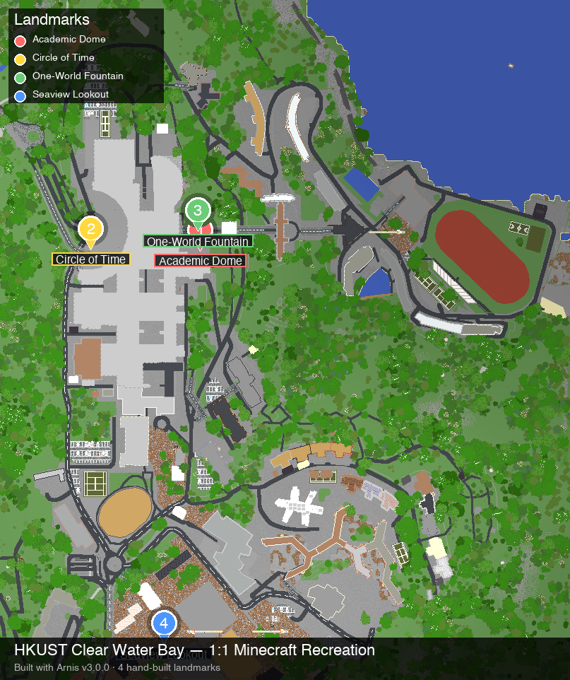

# HKUST in Minecraft

A 1:1 Minecraft Bedrock Edition recreation of the Hong Kong University of Science and Technology (HKUST) Clear Water Bay campus, generated from real-world OpenStreetMap + Mapterhorn elevation data using [Arnis v3.0.0](https://github.com/louis-e/arnis).



---

## What's inside

- **`worlds/final/HKUST-2026-Bedrock.mcworld`** — Ready-to-load Bedrock Edition world (~8 MB). Drop it into Minecraft Bedrock on Windows / iOS / Android / Xbox / PlayStation.
- **`landmarks/`** — Blueprint JSON for HKUST's four most iconic landmarks (Arnis doesn't model these semantically yet):
  - `01-academic-dome.schem` (41×26×41, 3210 blocks) — the round academic dome
  - `02-circle-of-time-sundial.schem` (9×8×9, 183 blocks) — Red Bird sundial at North Gate
  - `03-one-world-fountain.schem` (13×6×13, 343 blocks) — One-World Fountain at Central Piazza
  - `04-seaview-railings.schem` (601×3×5, 1852 blocks) — 600 m balustrade along Clear Water Bay
- **`previews/`** — Top-down PNG previews of the generated map, annotated with the 4 hand-built landmarks.
- **`osm/hkust-overpass.json`** — Offline-cached Overpass API dump for reproducible builds.
- **`scripts/`** — Generation + annotation Python / shell scripts.
- **`arnis/`** — Arnis v3.0.0 macOS universal binary (`arnis-mac-universal`, 107 MB).

> **v1.0.1 note:** The four landmark `.schem` files are currently **JSON blueprints only** (not yet baked into `HKUST-2026-Bedrock.mcworld`). To see them in-game, load them via WorldEdit BE addon's `//schem load` + `//schem paste` inside the Bedrock client — see `landmarks/README.md` for paste coordinates. Native in-`.mcworld` injection is planned for v1.1.

---

## Coverage

| | |
|---|---|
| Bounding box | `22.3317768,114.2617409,22.3404248,114.2695826` |
| OSM relation | way `40664120` (amenity=university) |
| Scale | 1 block per meter (1:1) |
| Elevation range | ~168 m vertical relief (Mapterhorn, no `--aws-only-elevation`) |
| Trees | ~870 procedurally-placed (746 regional + 124 vanilla sprinkle) |
| Buildings | OSM footprints + 22 Overture-enriched + 4 hand-built (paste-only) |
| Generation | ~9 seconds on M-series Mac, ~1.5 GB peak RAM |
| Output format | Bedrock `.mcworld` with ±512 build-height behavior pack (requires Minecraft 1.21.40+) |

---

## What v1.0.1 added (vs v1.0)

- **Realistic elevation**: removed `--aws-only-elevation` so Arnis uses Mapterhorn (global high-res + regional 1 m providers) instead of 30 m AWS Terrain Tiles. The campus now has ~168 m of vertical relief matching real Clear Water Bay.
- **Climate-driven biomes**: enabled by default in Arnis v3.0.0 — forests spawn in the right zones, not randomly.
- **Region-aware tree pack**: 746 procedural trees placed by Arnis's tree processor across grass/forest/parks.
- **Building interiors**: `--interior=true` adds internal floors to buildings so windows aren't black voids.
- **Baked per-chunk lighting** (`--bake-lighting`): distant chunks render lit in LOD mods (Voxy / Chunky) without the player needing to visit them first.
- **Better land-cover repair**: Gaussian-smoothed built-up cells, reclassified piers/embankments as water, pulled coastal cells toward shoreline.

World file size grew from **~3 MB → ~8 MB** because of all the new geometry.

---

## How it was built

### 1. Cache OSM data (one-time, offline-reusable)

```bash
./arnis/arnis-mac-universal \
  --bbox="22.3317768,114.2617409,22.3404248,114.2695826" \
  --save-json-file=osm/hkust-overpass.json
```

### 2. Generate the world (v1.0.1 command)

```bash
./arnis/arnis-mac-universal \
  --file=osm/hkust-overpass.json \
  --bedrock \
  --output-dir=worlds/final \
  --bbox="22.3317768,114.2617409,22.3404248,114.2695826" \
  --scale=1.0 \
  --spawn-lat=22.3383 --spawn-lng=114.2683 \
  --gamemode=creative \
  --world-time=6000 \
  --disable-height-limit \
  --map-preview \
  --overture=true \
  --fillground \
  --terrain \
  --interior=true \
  --bake-lighting
```

Key flags for fidelity:
- `--terrain` — read real Mapterhorn elevation, generate hills/coast
- `--interior=true` — add internal floors to buildings
- `--bake-lighting` — pre-compute chunk lighting for LOD mods
- `--overture=true` — supplement OSM with satellite-detected building footprints

### 3. Hand-built landmark blueprints (paste-only in v1.0.1)

```bash
python3 landmarks/generate_schems.py
```

To see them in-game, install the **WorldEdit BE** addon in Minecraft Bedrock, then:

```
//schem load 01-academic-dome
//schem paste
```

Coordinates and material guides are in `landmarks/README.md`.

> **v1.1 plan:** Landmarks will be auto-injected into the `.mcworld` via a custom Arnis element processor. See `landmarks/README.md` for the design notes.

### 4. Render the annotated preview

```bash
python3 scripts/annotate_preview.py
```

---

## Requirements

- macOS Apple Silicon or Intel (the `arnis-mac-universal` binary works on both)
- Minecraft Bedrock Edition **1.21.40 or newer** (for the extended build-height behavior pack)
- For schematic rebuilding: WorldEdit BE addon (optional in v1.0.1, mandatory once landmarks are paste-only)

---

## Embed on a website

The annotated top-down PNG is included as `previews/hkust-topdown-annotated.png`. The HKUST AI Applications Society admission-letter site embeds it at `src/app/content/minecraft/page.tsx` with a download link to `HKUST-2026-Bedrock.mcworld`.

---

## Credits

- Data: [OpenStreetMap contributors](https://www.openstreetmap.org/copyright) (ODbL)
- Elevation: Mapterhorn (global) + AWS Terrain Tiles + regional high-res providers
- Building enrichment: [Overture Maps](https://overturemaps.org/)
- Generation: [Arnis](https://github.com/louis-e/arnis) by [@louis-e](https://github.com/louis-e) and contributors (Apache-2.0)
- Project: HKUST AI Application Society · Cyber Foundation · 2026

---

## License

The HKUST campus data is derived from OpenStreetMap (ODbL). The generated Minecraft world, schematics, and annotated previews are released under CC BY-SA 4.0 by the HKUST AI Application Society.
